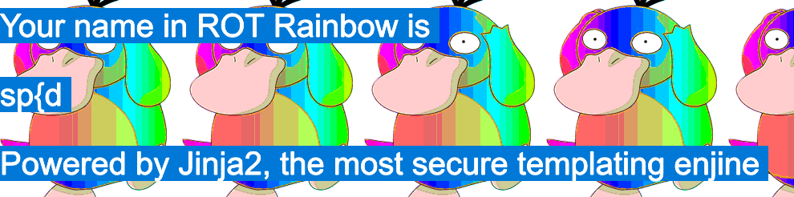
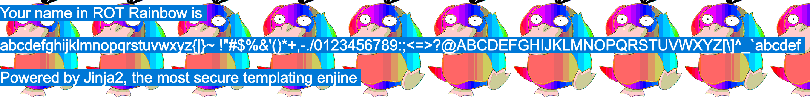
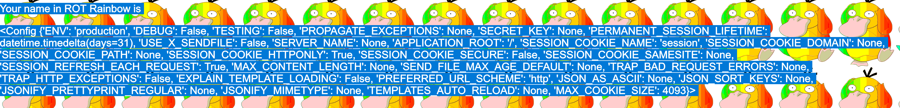
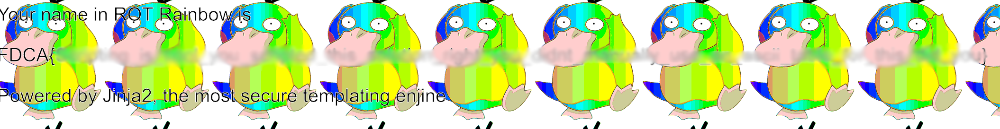

# FDCA Julectf
This is a writeup for the December 13th challenge of the FDCA Christmas CTF 2022

https://julectf.fdca.dk/

## Challenge

"*FEAT. Kalmarunionen*

*Tror der er nogen der er begyndt at kede sig her op til jul, der er nogen der lagt en server ud på internettet. Tror måske en af hvemmerne er med i kalmaruninen, har han sørget for at sikre sin super seje 'ROT rainbow'?
https://fdca-willy.chals.io/*"

## Solution
Following the URL, we are presented with the following website:


The text says: "I made a cool ROT rainbow! Because ROT13 is too boring: Whats your name in ROT rainbow?"

Let's try to input something and see what it does... like say: `soya`




Ok, so `soya` became `sp{d`. Apparently the input is rotated following some pattern. 

Also, we're given a hint that the website is rendered using Jinja2. Jinja is a templating engine used for creating HTML templates and other documents that can contain dynamic content. A neat tool, but unfortunately it also has some uninteded behaviour, if the input is not sanitized correctly. Googling template injection in Jinja should give you some nice hits. Later in this writeup, I will be referring to the cheatsheet I found [here](https://book.hacktricks.xyz/pentesting-web/ssti-server-side-template-injection/jinja2-ssti).

Let's see if we can figure out a pattern for the input rotation. I just tried to input a bunch of a's:





Great! It looks like the rotation rolls over at some point. From this we learn that we have the following character space of 95 characters: ``abcdefghijklmnopqrstuvwxyz{|}~ !"#$%&'()*+,-./0123456789:;<=>?@ABCDEFGHIJKLMNOPQRSTUVWXYZ[\]^_` ``


Let's try to make some sense of this. 
- Recall the input `soya` which became `sp{d`. The first thing we notice is that the first character (at index 0) was not rotated. 
- `o` became `p` (rotated by 1 step). 
- `y` was rotated to `{` (rotated by 2 steps).
- And `a` became `d` (rotated by 3 steps).


See a pattern here? Our input string is rotated character by character, based on their index in the input string and replaced with the corresponding character from the character space. 


Now we know how the input string is rotated. In order to try some template injection, we need to create a string of characters that, when rotated by the application, will result in our desired test string. For example, we can try to see if we can get the application to dump its environment variables by inputting `{{ config }}` [as suggested here](https://book.hacktricks.xyz/pentesting-web/ssti-server-side-template-injection/jinja2-ssti#dump-all-config-variables)


Let's go over how to reverse this for the string ` {{ config }} `:


- The first `{` is at index 0 in our string, so it will not be rotated
- The next `{` is at index 1. Finding `{` in our character space, we rotate by -1, and it becomes `z`
- Then we have a `space` at index 2, we find it in the character space and rotate by -2. That is a `}`
- Continuing like that, we find that the string ``{z}`ki`b_vsr`` will be rotated to `{{ config }}` by the application.


Aaaand it turns out that the application indeed is vulnerable to template injections. This is the result from inputting ``{z}`ki`b_vsr`` - the environment variables are dumped by the application - neat!




Obviously, continuing to rotate the input by hand was going to be very, very tiresome, so I wrote a small Python script that would rotate the input string for me:

```
char_space = r'''abcdefghijklmnopqrstuvwxyz{|}~ !"#$%&'()*+,-./0123456789:;<=>?@ABCDEFGHIJKLMNOPQRSTUVWXYZ[\]^_`'''

input = r'''{{ config }}'''

output = ""

for idx, char in enumerate(input):

	char_space_idx = char_space.find(char)

	rot_idx = ((char_space_idx - idx) % 95)

	output += char_space[rot_idx]

print(output) # will print {z}`ki`b_vsr
```

Ok, now what? As described in the [link](https://book.hacktricks.xyz/pentesting-web/ssti-server-side-template-injection/jinja2-ssti#jinja-injection): **"in a Jinja injection you need to find a way to escape from the sandbox and recover access the regular python execution flow. To do so, you need to abuse objects that are from the non-sandboxed environment but are accessible from the sandbox."**

So in the end, our ultimate goal is to be able to execute code on the machine. Following the guide on HackTricks, I tested out different input to find a viable way to obtain remote code execution on the machine. By  trial and error, it became clear that there was some input filtering going on as well, meaning that characters such as `_` and `.` in the evaluated string would make the server return an error. Finding a way to escape these, I finally managed to grep the flag from the `flag.txt` file on the server:

``{{request|attr('application')|attr('\x5f\x5fglobals\x5f\x5f')|attr('\x5f\x5fgetitem\x5f\x5f')('\x5f\x5fbuiltins\x5f\x5f')|attr('\x5f\x5fgetitem\x5f\x5f')('\x5f\x5fimport\x5f\x5f')('os')|attr('popen')('grep FDCA flag*')|attr('read')()}}``


